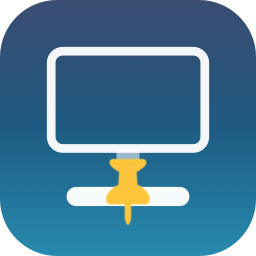

# DockAnchor

A tiny menu-bar utility that keeps the macOS Dock pinned to one display when you're using multiple monitors.

<p align="center"></p>

## The problem

By default, macOS reveals the Dock on whichever display your pointer's bottom edge touches. With two or three monitors, that means the Dock keeps jumping to whatever screen you happen to be working on — annoying if you want it to always live on one particular display.

## What DockAnchor does

DockAnchor pins the Dock to a display you choose. On every *other* connected screen, it keeps your pointer from ever touching the true bottom pixel row — the one thing macOS actually checks before it reveals the Dock — so the Dock simply never triggers there. Your chosen display behaves completely normally.

It remembers your choice **per combination of connected displays**, not globally. So if you use a different monitor setup at home than at the office, DockAnchor tracks each combination separately and restores the right anchor automatically when it recognizes that set of screens.

## How it works

macOS only reveals the Dock on a display once the pointer reaches that display's bottom-most pixel row. DockAnchor runs a lightweight `CGEventTap` that watches global pointer movement; whenever the pointer is about to cross into that last pixel row on a non-anchor display, it's clamped a few pixels short. This requires the **Accessibility** permission (System Settings → Privacy & Security → Accessibility), since that's what's needed to observe and adjust a global input stream. DockAnchor never reads keystrokes and never modifies anything outside of pointer position near a screen edge.

## Install

1. Download the latest `DockAnchor-*.dmg` from [Releases](https://github.com/Micropeptide/DockAnchor/releases).
2. Open it and drag `DockAnchor.app` onto the `Applications` shortcut.
3. **Right-click → Open** the first time (it's not notarized with a paid Apple Developer certificate, so Gatekeeper will otherwise refuse to launch it as "from an unidentified developer" — this is a one-time step).
4. Grant Accessibility permission when prompted, or via the app's own "Open Accessibility Settings…" menu item.
5. Pick your anchor display from the menu bar icon → **Anchor Screen**.

(A plain `.zip` of the `.app` is also attached to each release, if you'd rather skip the DMG.)

DockAnchor runs with no Dock icon of its own — look for its icon in the menu bar.

## Menu

- **Guard Dock** — pause/resume without quitting.
- **Anchor Screen** — pick which connected display keeps the Dock.
- **Launch at Login** — installs/removes a per-user LaunchAgent.
- **Check for Updates** — Weekly / Monthly / Never. DockAnchor only *checks* GitHub Releases for a newer version tag in the background; it never downloads or installs anything automatically. If a newer version exists, a menu item appears linking to the release page so you can grab it yourself.
- **About DockAnchor** — version info and a link back here.

## Building from source

Requires Xcode (for its SDK/toolchain) and the Swift toolchain that ships with it.

```bash
git clone https://github.com/Micropeptide/DockAnchor.git
cd DockAnchor
./build.sh
```

This builds the executable via Swift Package Manager, generates the `.app` bundle with its icon, ad-hoc signs it, and installs it to `~/Applications/DockAnchor.app`.

To package a distributable `.dmg` (what's attached to each release):

```bash
./package_dmg.sh
```

To regenerate the icon after changing `Tools/generate_icon.swift`:

```bash
swift Tools/generate_icon.swift AppIcon.iconset
iconutil -c icns AppIcon.iconset -o Resources/AppIcon.icns
rm -rf AppIcon.iconset
```

## Notes

- Ad-hoc signed, not notarized — expect the standard first-run Gatekeeper prompt, and expect it again after any rebuild from source (rebuilding changes the code signature).
- Tested with 2–3 external displays on Apple Silicon Macs.

## License

MIT — see [LICENSE](LICENSE).

by [Micropeptide](https://github.com/Micropeptide)
